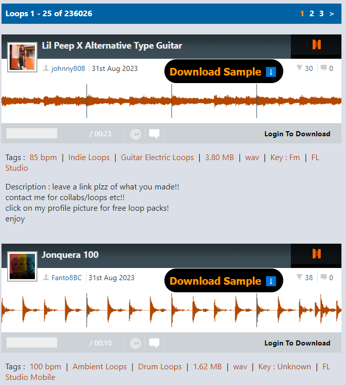

    
    <h1>Looperman.com Downloader</h1>
    <h3>With this Chrome Extenstion you can download MP3s on Looperman.com without logging in.</h3>

## Installation
- Download a zip of the repo and unzip it on your computer.
- **Open [the extensions page](chrome://extensions)** in your browser: `chrome://extensions`. 
- Click the button **_load unpacked extension_**. (Must have Developer mode enabled)
- In the window that pops up, **select the folder that contains this extension**, then **click _ok_**.
- **Done!** A new extension called Looperman.com Downloader will be in your Extenstions list.

    

